## 프로젝트 소개
효과적으로 멀티미디어를 관리할 수 있는 프로그램입니다.  
사진, 동영상 등의 멀티미디어에 이름, 이벤트 등의 속성을 부여해 멀티미디어 검색이 용이하도록 합니다.  
효과적인 자료구조를 활용해 프로그램을 개발합니다.  
*추후 GUI를 활용할 수 있도록 업데이트 할 계획입니다. 

## 프로젝트 내용
### 1. 프로그램 실행 시 처음 뜨는 화면  
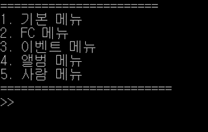
---
### 2. 기본메뉴  
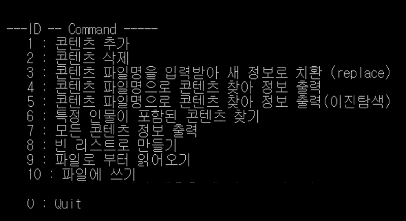  
- 기본 메뉴에서 마스터 리스트에 컨텐츠를 추가하면 이벤트/사람리스트에도 자동으로 반영됩니다.  
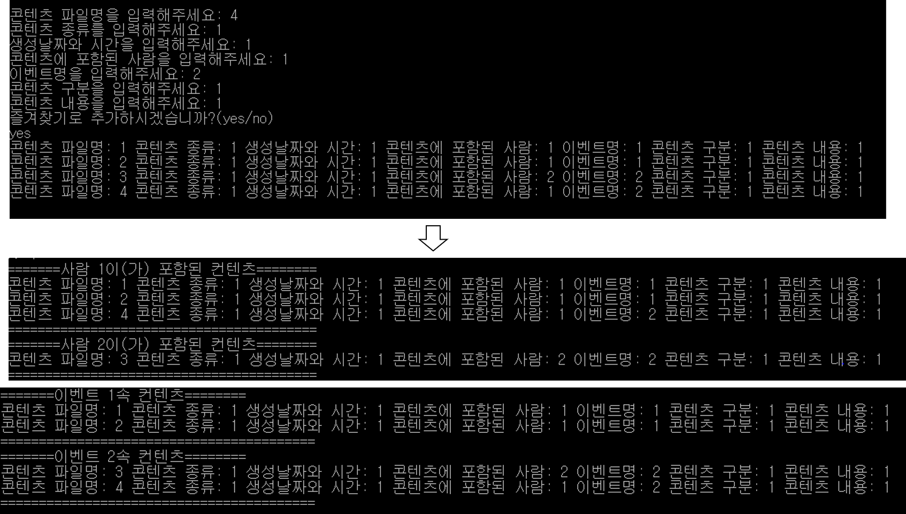   
---
### 3. FC 메뉴 
- 좋아하는 콘텐츠들을 모아 볼 수 있는 기능입니다.    
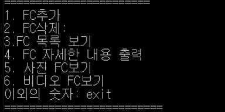  
- FC 추가/삭제 기능입니다.  
  
- FC에 속하는 콘텐츠들의 간략한 정보나 자세한 정보를 출력할 수 있습니다.  
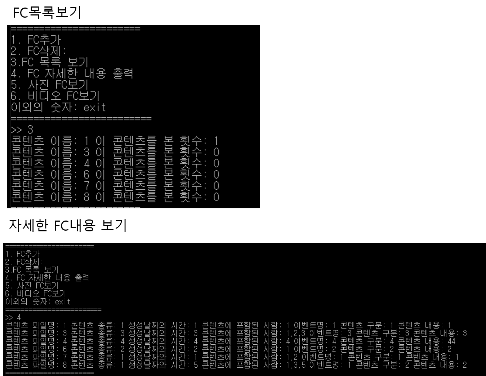
 - FC에 속하는 콘텐츠 들 중 비디오타입/사진 타입 별로 구분해 볼 수 있습니다  
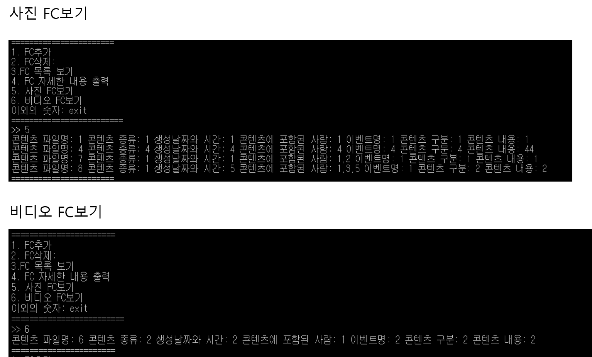   
---
### 4. 이벤트 메뉴 
- 기본적으로 마스터 리스트에서 컨텐츠의 업데이트가 발생하면 이벤트 리스트도 자동으로 업데이트 됩니다.   
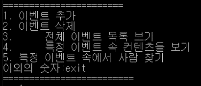  
- 전체 이벤트 내용을 출력합니다.   
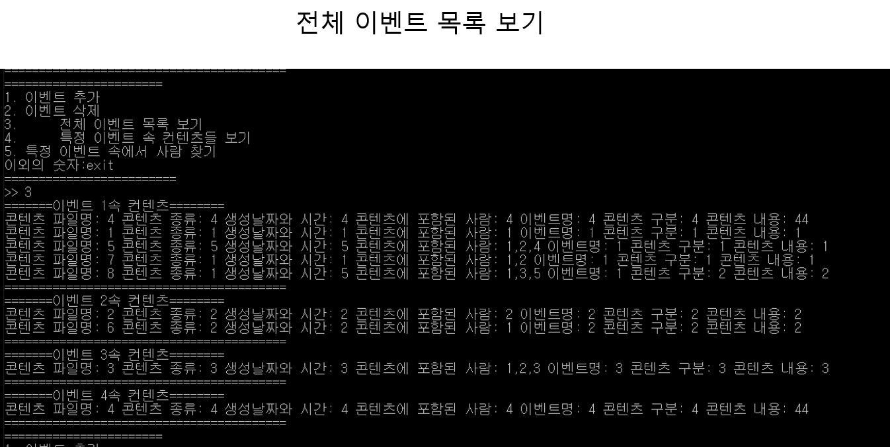  
- 입력된 이벤트명과 일치하는 콘텐츠들을 출력합니다.  
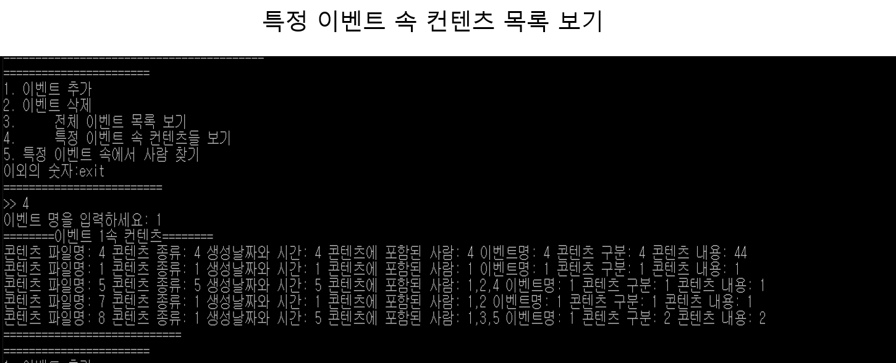  
- 이벤트명과 콘텐츠에 포함된 사람이름을 입력받아 둘다 일치하는 콘텐츠들을 출력합니다.  
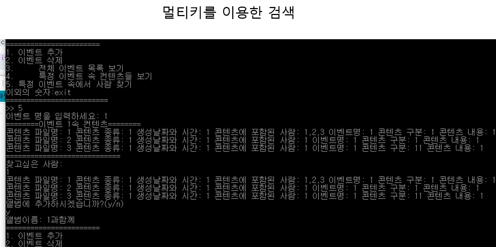  
---
### 5. 앨범메뉴 
- 사용자가 임의로 원하는 콘텐츠끼리 모아서 앨범을 구성할 수 있습니다.  
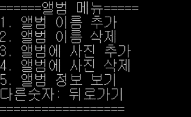  
- 앨범을 새로 추가하거나 삭제하는 화면입니다. 앨범이 삭제돼도 원본데이터는 남습니다.  
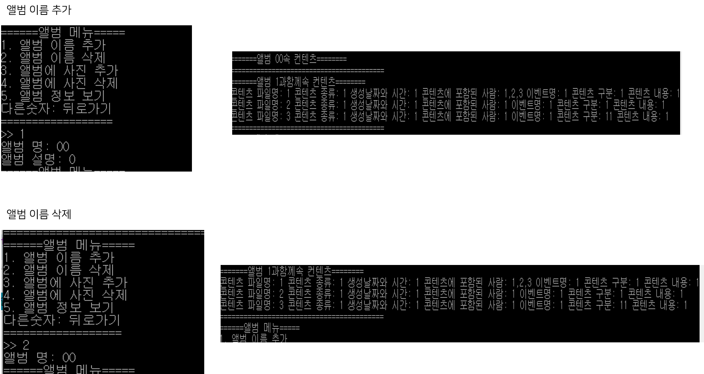  
- 특정 앨범명을 입력받아 그 앨범에 콘텐츠를 추가합니다.  
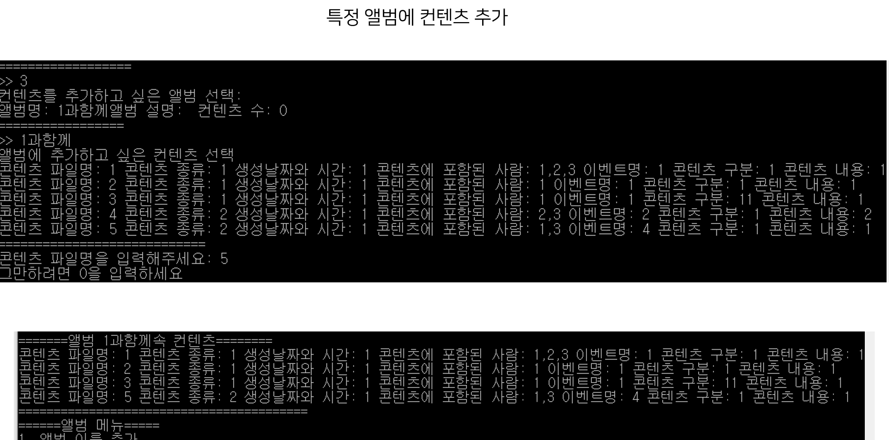  
- 특정 앨범명을 입력받아 그 앨범에서 콘텐츠를 제거합니다.  
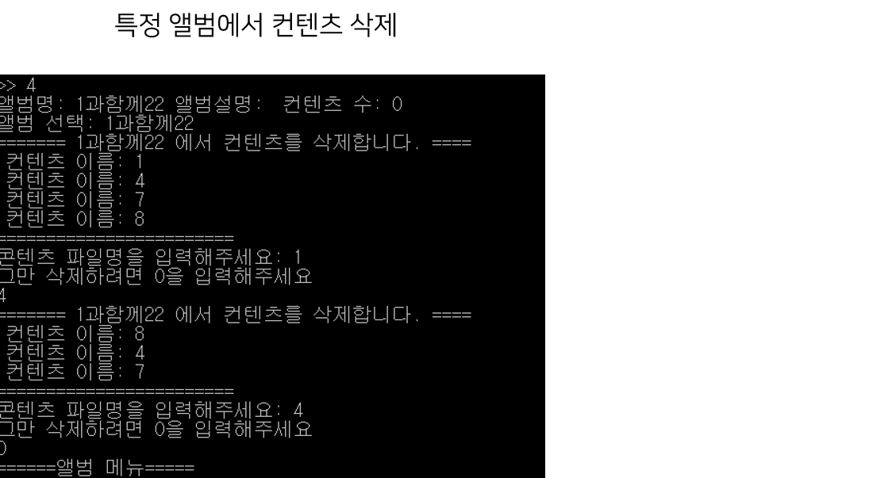  
---
### 6. 사람메뉴 
- 특정 사람이 포함된 컨텐츠에 대해서 다룹니다.  
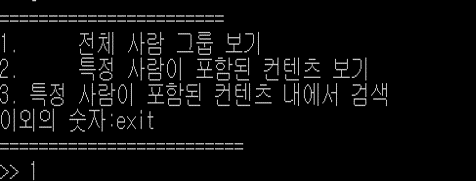  
- 사람이 포함된 컨텐츠를 모두 출력합니다.  
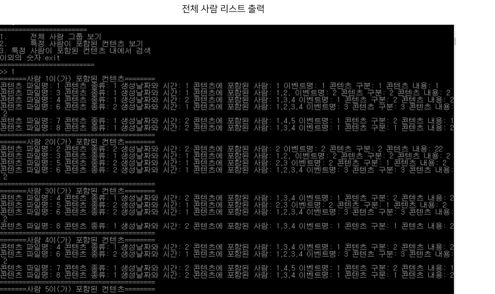  
- 특정 사람이름을 입력받고 그 사람이 포함된 컨텐츠만 출력합니다.  
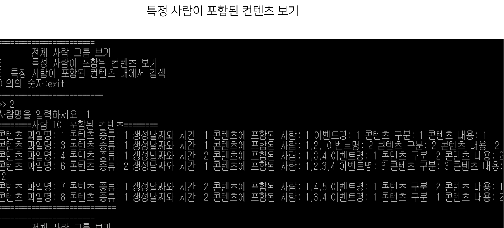  
